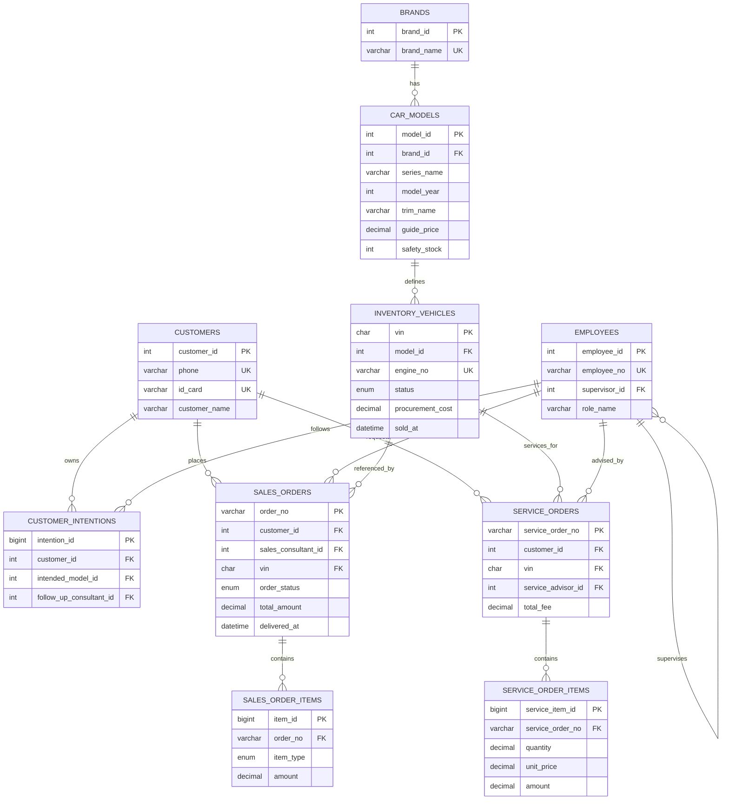

# 汽车销售管理系统数据库设计说明书

## 1. 需求转化（核心实体与规则）

核心实体：品牌、车型、库存车辆、客户、客户意向、员工、销售订单、订单明细、服务工单、服务明细。

核心规则：
- 规则A：新建销售订单时，车辆必须处于“在库”，并自动改为“已锁定”。
- 规则B：订单状态变为“已完成”时，车辆自动改为“已售出”，并记录交车时间。
- 规则C：车辆状态变化实时反映库存统计（在库/锁定/在途/已售）。

## 2. E-R 图（Mermaid）

> 可直接复制到支持 Mermaid 的 Markdown 渲染器；也可在 draw.io 中通过 Mermaid 插件导入生成图形。

## 3. 3NF 关系模式

1. brands(brand_id PK, brand_name UQ, created_at)
2. car_models(model_id PK, brand_id FK, series_name, model_year, trim_name, guide_price, displacement, vehicle_type, safety_stock, created_at, UQ(brand_id,series_name,model_year,trim_name))
3. employees(employee_id PK, employee_no UQ, employee_name, role_name, department, supervisor_id FK self, hire_date, created_at)
4. customers(customer_id PK, customer_name, gender, phone UQ, id_card UQ, address, first_visit_date, source_channel, created_at)
5. customer_intentions(intention_id PK, customer_id FK, intended_model_id FK, intention_level, notes, follow_up_consultant_id FK, next_contact_at, created_at)
6. inventory_vehicles(vin PK, model_id FK, color, engine_no UQ, production_date, inbound_date, procurement_cost, suggested_retail_price, status, sold_at, created_at, updated_at)
7. sales_orders(order_no PK, customer_id FK, sales_consultant_id FK, vin FK, total_amount, deposit_amount, order_status, payment_method, created_at, delivered_at, updated_at)
8. sales_order_items(item_id PK, order_no FK, item_type, item_desc, amount, created_at)
9. service_orders(service_order_no PK, customer_id FK, vin FK, service_type, service_advisor_id FK, created_at, expected_finish_at, total_fee, status)
10. service_order_items(service_item_id PK, service_order_no FK, item_name, quantity, unit_price, amount)

所有非主属性都完全依赖主键，且不存在传递依赖，满足3NF。

## 4. 3NF设计如何满足业务规则（详细说明）

### 4.1 规则A：创建订单时“在库校验+立即锁车”

**业务要求**：新建销售订单时，车辆必须是“在库”，并自动改为“已锁定”。

**设计支撑点**：
1. `sales_orders.vin` 外键指向 `inventory_vehicles.vin`，确保订单引用的车辆真实存在，杜绝“无车下单”。
2. `inventory_vehicles.status` 采用枚举约束（在途/在库/已锁定/已售出），状态值合法且统一。
3. 触发器 `trg_lock_car_on_order`（`BEFORE INSERT ON sales_orders`）在插单前读取车辆状态：
   - 非“在库”直接 `SIGNAL` 拒绝写入；
   - 为“在库”时立即更新为“已锁定”。
4. 存储过程 `sp_create_sales_order` 在事务内执行下单流程，并对车辆行 `FOR UPDATE` 锁定，避免并发下同一 VIN 被重复下单。

**效果**：规则A在“外键完整性 + 状态域约束 + 触发器原子校验更新 + 事务并发控制”四层同时保障，保证一致性。

### 4.2 规则B：订单完成时车辆自动售出并记录交车时间

**业务要求**：订单状态改为“已完成”时，车辆必须改为“已售出”，并写入交车时间。

**设计支撑点**：
1. `sales_orders.order_status` 为枚举，确保“已完成”属于标准化状态迁移目标。
2. 触发器 `trg_update_inventory_on_delivery`（`BEFORE UPDATE ON sales_orders`）仅在状态从非“已完成”变更为“已完成”时触发：
   - `NEW.delivered_at = COALESCE(NEW.delivered_at, NOW())`，自动补齐交车时间；
   - 更新 `inventory_vehicles.status='已售出'`，并同步 `sold_at = delivered_at`。
3. 订单与车辆通过 `vin` 关联，状态流转直接定位到同一台物理车辆，不会出现“订单完成但车辆未售出”的脱节。

**效果**：规则B通过“订单状态驱动车辆状态”的触发器联动落地，且交车时间与售出时间同步，满足审计追踪。

### 4.3 规则C：库存状态变化可实时反映库存统计

**业务要求**：入库/锁定/售出等状态变化后，库存统计自动且实时更新。

**设计支撑点**：
1. 库存事实源统一在 `inventory_vehicles` 单表，避免冗余库存汇总表导致的延迟与不一致。
2. 视图 `v_inventory_summary` 基于 `inventory_vehicles.status` 按车型实时聚合 `在库/已锁定/在途/已售出` 数量。
3. 规则A/B触发器保证状态写入及时、单点、可追踪；视图每次查询实时计算，天然反映最新库存状态。
4. 索引 `idx_inventory_status_model (status, model_id)` 支撑高频库存统计和预警查询，在实时性与性能间保持平衡。

**效果**：通过“单一事实源 + 实时聚合视图 + 自动状态维护 + 索引优化”实现规则C。

### 4.4 为什么该方案符合3NF且能支撑规则执行

1. 主数据（品牌/车型）、交易数据（订单/明细）、过程数据（售后）分层清晰，避免跨域冗余。
2. 每张表非主属性只依赖本表主键，不依赖其他非键字段，减少更新异常。
3. 业务规则不通过手工同步字段实现，而通过触发器与事务在写路径统一控制，既满足3NF，也保证业务一致性。

## 5. 脚本清单

- `sql/01_create_schema.sql`
- `sql/02_init_data.sql`
- `sql/03_views.sql`
- `sql/04_indexes.sql`
- `sql/05_triggers.sql`
- `sql/06_procedures.sql`
- `sql/07_queries.sql`
