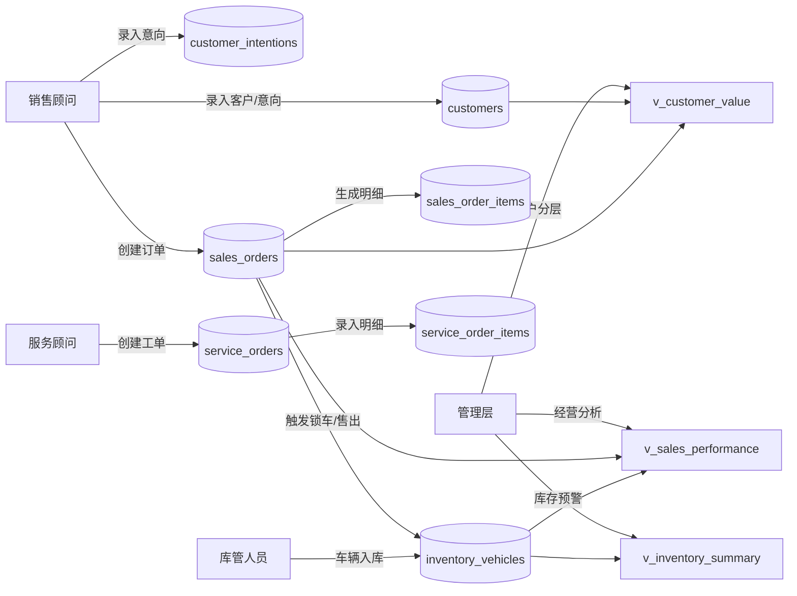
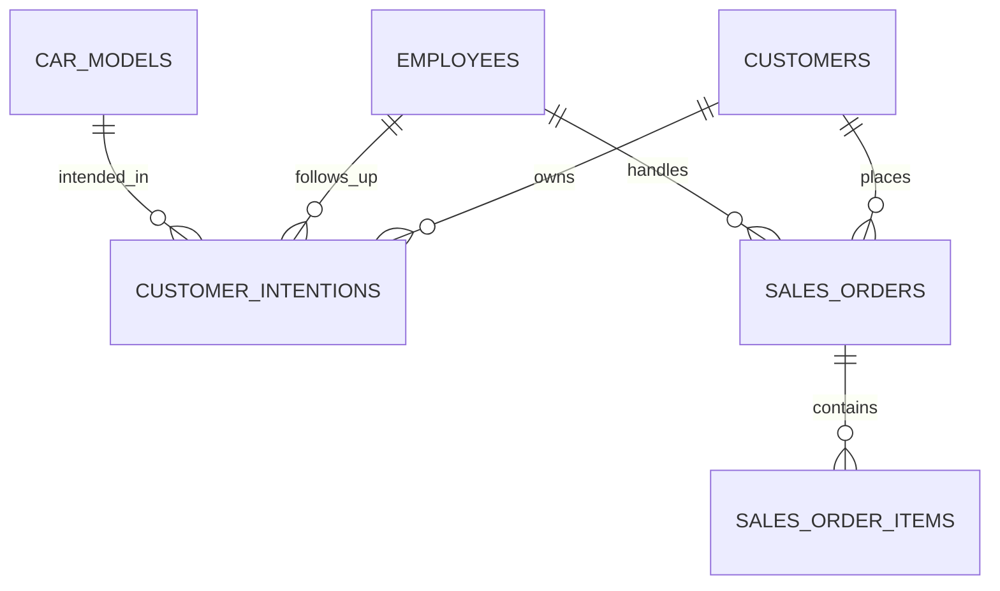
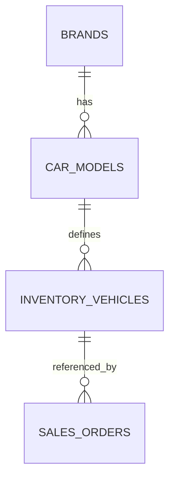
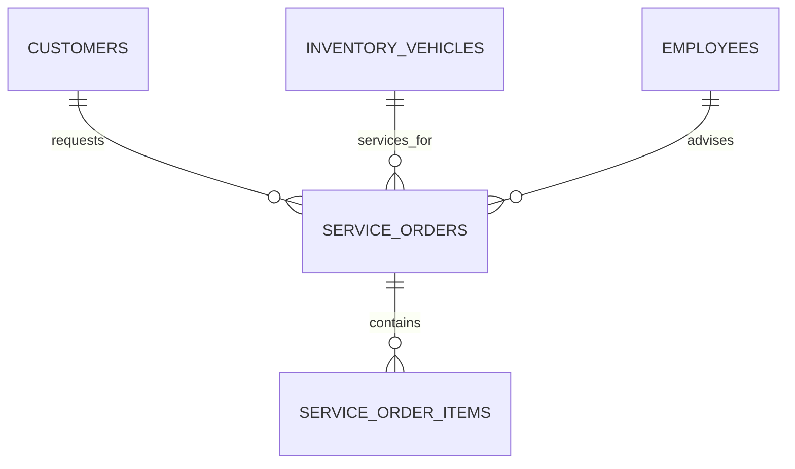
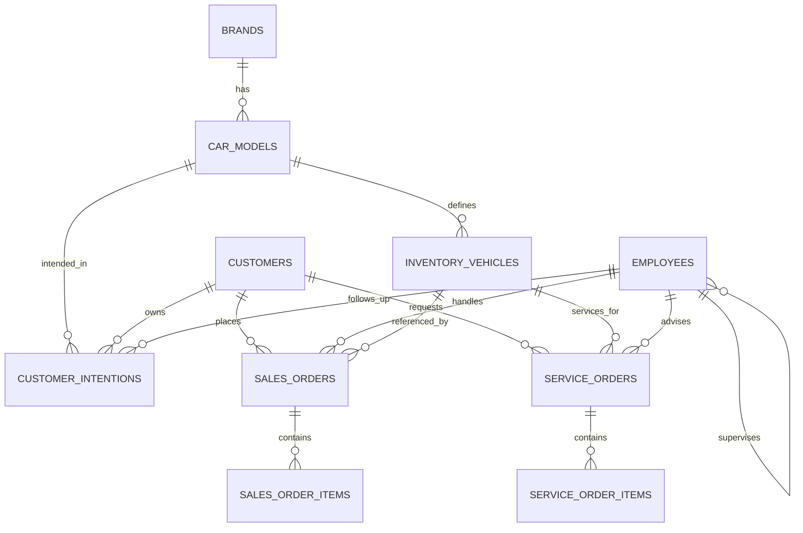

# 汽车销售管理系统课程设计报告

## 目录

- 第1章 绪论
  - 1.1 项目背景与意义
    - 1.1.1 速驰汽车销售公司的业务现状
    - 1.1.2 开发本系统的必要性
  - 1.2 项目目标
    - 1.2.1 核心业务目标（采购、销售、库存、售后）
    - 1.2.2 系统功能目标概述
- 第2章 需求分析
  - 2.1 业务流程分析
    - 2.1.1 采购与入库流程
    - 2.1.2 销售与订单处理流程
    - 2.1.3 售后服务流程
  - 2.2 数据需求分析
    - 2.2.1 实体分析（品牌、车型、库存车辆、客户、员工等）
    - 2.2.2 数据流图 (DFD)
  - 2.3 功能需求定义
    - 2.3.1 客户与意向管理
    - 2.3.2 销售订单管理
    - 2.3.3 库存与车辆状态管理
    - 2.3.4 售后服务管理
    - 2.3.5 报表统计与决策支持
- 第3章 数据库概念结构设计 (E-R图)
  - 3.1 实体定义
    - 3.1.1 核心实体属性（品牌、车型、库存车辆、客户、员工、订单等）
  - 3.2 实体间关系分析
    - 3.2.1 一对多关系（如：品牌-车型）
    - 3.2.2 多对多关系（如：订单-配件，需通过明细表转换）
  - 3.3 E-R图设计
    - 3.3.1 局部E-R图（分模块绘制）
    - 3.3.2 全局E-R图（整合后的完整图）
- 第4章 数据库逻辑结构与物理设计
  - 4.1 逻辑结构设计
    - 4.1.1 关系模式转化（E-R图转关系模型）
    - 4.1.2 范式分析（确保满足3NF）
  - 4.2 物理结构设计
    - 4.2.1 数据库表结构设计（列出所有表：字段名、数据类型、长度、约束、主键/外键）
    - 4.2.2 索引设计（说明为哪些字段创建了索引及其目的）
  - 4.3 数据库实施
    - 4.3.1 创建数据库与表空间的SQL语句
    - 4.3.2 数据初始化脚本说明
- 第5章 数据库高级对象设计与实现
  - 5.1 视图设计
    - 5.1.1 v_sales_performance (销售业绩视图)
    - 5.1.2 v_inventory_summary (库存汇总视图)
    - 5.1.3 v_customer_value (客户价值视图)
  - 5.2 触发器设计
    - 5.2.1 trg_lock_car_on_order (下单锁定车辆逻辑)
    - 5.2.2 trg_update_inventory_on_delivery (交车更新库存逻辑)
  - 5.3 存储过程设计
    - 5.3.1 sp_create_sales_order (创建订单存储过程及事务处理)
    - 5.3.2 sp_get_monthly_report (月度报表存储过程)
- 第6章 应用程序开发与功能实现
  - 6.1 开发环境与技术架构
    - 6.1.1 开发语言与工具（Java/Python）
    - 6.1.2 数据库连接方式（JDBC/ODBC/Connector）
  - 6.2 系统功能模块实现
    - 6.2.1 销售前台模块（客户管理、订单创建）
    - 6.2.2 库存管理模块（入库、查询、预警）
    - 6.2.3 报表中心模块（业绩榜、畅销车型、月度统计）
- 第7章 系统测试
  - 7.1 测试环境
  - 7.2 功能测试
    - 7.2.1 核心业务逻辑测试（如：下单后车辆状态是否自动锁定）
    - 7.2.2 复杂查询测试（Q1-Q7需求验证）
    - 7.2.3 事务一致性测试（回滚场景）
  - 7.3 测试结果分析
    - 7.3.1 测试用例执行情况表
    - 7.3.2 关键功能运行截图展示
- 第8章 总结与展望
  - 8.1 课程设计总结
    - 8.1.1 完成的主要工作
    - 8.1.2 遇到的难点与解决方案
  - 8.2 心得体会
  - 8.3 系统改进方向
- 附录
  - 附录A：数据库表结构详细说明
  - 附录B：主要SQL代码清单
  - 附录C：系统界面截图

---

## 第1章 绪论

### 1.1 项目背景与意义

#### 1.1.1 速驰汽车销售公司的业务现状

速驰汽车销售公司当前业务覆盖整车销售、库存管理、客户跟进、售后服务与经营分析。现有业务问题主要体现在：

1. 订单与库存状态联动依赖人工操作，容易出现“已下单未锁车”“已交付未售出”的数据不一致问题。  
2. 客户意向跟进分散在人工记录中，跟进节奏与成交转化缺乏可追踪数据。  
3. 销售业绩、库存预警、客户价值等统计口径不统一，管理层决策时效性不足。  
4. 售后工单与销售履历数据割裂，无法形成客户全生命周期视图。  

#### 1.1.2 开发本系统的必要性

为解决上述问题，需要构建一个以数据库为核心的业务系统，实现：

- 订单、库存、交付状态的数据库级强一致控制；
- 客户、订单、售后全链路数据沉淀；
- 面向管理层的实时统计与预警；
- 通过标准化 SQL 脚本与应用端调用，形成可复现、可扩展的课程设计成果。

### 1.2 项目目标

#### 1.2.1 核心业务目标（采购、销售、库存、售后）

1. **采购/入库目标**：支持车辆入库登记、状态标识（在途/在库/已锁定/已售出）与库存可视化。  
2. **销售目标**：支持标准化下单流程，保障下单时库存校验与锁车。  
3. **库存目标**：实现库存状态实时统计，支持安全库存预警。  
4. **售后目标**：支持服务工单及明细记录，沉淀售后费用与服务类型数据。  

#### 1.2.2 系统功能目标概述

系统按“SQL 数据层 + Python 控制台应用层”实现，交付：

- 10 张核心业务表；
- 3 个业务视图、2 个触发器、2 个存储过程；
- 8 个复杂业务查询（Q1-Q8）；
- 覆盖销售前台、库存管理、报表中心的控制台功能菜单。

---

## 第2章 需求分析

### 2.1 业务流程分析

#### 2.1.1 采购与入库流程

1. 车辆到店前登记为在途。  
2. 到店验收后录入 VIN、车型、发动机号、采购成本、建议零售价等信息。  
3. 入库后状态改为在库，参与库存统计与安全库存预警。  

#### 2.1.2 销售与订单处理流程

1. 销售顾问录入客户及意向信息。  
2. 创建销售订单时校验 VIN 状态必须为在库。  
3. 下单成功后自动锁车（状态改为已锁定）。  
4. 订单状态流转（待定金/待交付/已完成/已取消）。  
5. 订单完成时自动更新车辆为已售出并记录交付时间。  

#### 2.1.3 售后服务流程

1. 客户到店创建服务工单（保养/维修/质保/美容）。  
2. 录入工单明细（配件、工时、数量、单价、金额）。  
3. 工单状态按已创建→进行中→已完成流转，累计形成客户售后履历。  

### 2.2 数据需求分析

#### 2.2.1 实体分析（品牌、车型、库存车辆、客户、员工等）

系统核心实体包括：

- 主数据：`brands`、`car_models`
- 人员与客户：`employees`、`customers`、`customer_intentions`
- 销售交易：`sales_orders`、`sales_order_items`
- 车辆库存：`inventory_vehicles`
- 售后服务：`service_orders`、`service_order_items`

#### 2.2.2 数据流图 (DFD)



### 2.3 功能需求定义

#### 2.3.1 客户与意向管理

- 创建客户档案；
- 维护意向车型、意向等级、跟进顾问、下次联系时间；
- 支持按客户生命周期持续跟进。

#### 2.3.2 销售订单管理

- 创建订单与订单明细；
- 支持定金、支付方式、订单状态管理；
- 支持销售顾问查询“我的订单”。

#### 2.3.3 库存与车辆状态管理

- 车辆入库登记；
- 按车型/状态查询库存；
- 安全库存预警与状态实时统计。

#### 2.3.4 售后服务管理

- 创建售后工单；
- 录入工单项目与费用；
- 查询客户售后历史记录。

#### 2.3.5 报表统计与决策支持

- 销售顾问月/季业绩统计；
- 畅销车型排行；
- 月度销售总览；
- 客户价值分层与渠道转化率分析。

---

## 第3章 数据库概念结构设计 (E-R图)

### 3.1 实体定义

#### 3.1.1 核心实体属性（品牌、车型、库存车辆、客户、员工、订单等）

1. **品牌（BRANDS）**：品牌标识与品牌名称。  
2. **车型（CAR_MODELS）**：车系、年款、配置、指导价、排量、车型类型、安全库存。  
3. **库存车辆（INVENTORY_VEHICLES）**：VIN、发动机号、颜色、生产/入库日期、成本价、建议零售价、状态。  
4. **客户（CUSTOMERS）**：身份信息、联系方式、首次到店时间、来源渠道。  
5. **员工（EMPLOYEES）**：工号、姓名、角色、部门、上级关系。  
6. **销售订单（SALES_ORDERS）**：客户、顾问、VIN、订单金额、定金、状态、支付方式、时间。  
7. **订单明细（SALES_ORDER_ITEMS）**：车辆项、选装项、保险项、其他项金额。  
8. **服务工单（SERVICE_ORDERS）**：客户、VIN、服务顾问、服务类型、总费用、状态。  
9. **服务明细（SERVICE_ORDER_ITEMS）**：项目名称、数量、单价、金额。  
10. **客户意向（CUSTOMER_INTENTIONS）**：意向车型、意向等级、跟进顾问、下次联系时间。  

### 3.2 实体间关系分析

#### 3.2.1 一对多关系（如：品牌-车型）

1. 品牌 1:N 车型  
2. 车型 1:N 库存车辆  
3. 车型 1:N 客户意向  
4. 客户 1:N 客户意向、销售订单、服务工单  
5. 员工 1:N 客户意向、销售订单、服务工单  
6. 员工（上级）1:N 员工（下级）  
7. 销售订单 1:N 订单明细  
8. 服务工单 1:N 服务明细  
9. 库存车辆 1:N 销售订单（历史记录维度）  
10. 库存车辆 1:N 服务工单  

#### 3.2.2 多对多关系（如：订单-配件，需通过明细表转换）

1. 订单与费用项（车辆/保险/选装/其他）是逻辑多对多关系，通过 `sales_order_items` 转换。  
2. 服务工单与服务项目/配件是逻辑多对多关系，通过 `service_order_items` 转换。  

### 3.3 E-R图设计

#### 3.3.1 局部E-R图（分模块绘制）

**（1）销售与客户模块**



**（2）库存与车型模块**



**（3）售后模块**



#### 3.3.2 全局E-R图（整合后的完整图）



---

## 第4章 数据库逻辑结构与物理设计

### 4.1 逻辑结构设计

#### 4.1.1 关系模式转化（E-R图转关系模型）

关系模式（主键PK，外键FK）：

1. `brands(brand_id PK, brand_name, created_at)`  
2. `car_models(model_id PK, brand_id FK, series_name, model_year, trim_name, guide_price, displacement, vehicle_type, safety_stock, created_at)`  
3. `employees(employee_id PK, employee_no, employee_name, role_name, department, supervisor_id FK, hire_date, created_at)`  
4. `customers(customer_id PK, customer_name, gender, phone, id_card, address, first_visit_date, source_channel, created_at)`  
5. `customer_intentions(intention_id PK, customer_id FK, intended_model_id FK, intention_level, notes, follow_up_consultant_id FK, next_contact_at, created_at)`  
6. `inventory_vehicles(vin PK, model_id FK, color, engine_no, production_date, inbound_date, procurement_cost, suggested_retail_price, status, sold_at, created_at, updated_at)`  
7. `sales_orders(order_no PK, customer_id FK, sales_consultant_id FK, vin FK, total_amount, deposit_amount, order_status, payment_method, created_at, delivered_at, updated_at)`  
8. `sales_order_items(item_id PK, order_no FK, item_type, item_desc, amount, created_at)`  
9. `service_orders(service_order_no PK, customer_id FK, vin FK, service_type, service_advisor_id FK, created_at, expected_finish_at, total_fee, status)`  
10. `service_order_items(service_item_id PK, service_order_no FK, item_name, quantity, unit_price, amount)`  

#### 4.1.2 范式分析（确保满足3NF）

1. 各表均具有明确主键，保证实体唯一性。  
2. 非主属性完全依赖主键，不存在部分函数依赖。  
3. 非主属性之间无传递依赖（如客户联系电话仅依赖 `customer_id`，不依赖其他非键字段）。  
4. 明细表（订单明细、服务明细）将多值/重复业务项拆分为独立关系，消除重复组。  
5. 状态流转通过触发器维护，不靠冗余字段手工同步，避免更新异常。  

### 4.2 物理结构设计

#### 4.2.1 数据库表结构设计（列出所有表：字段名、数据类型、长度、约束、主键/外键）

> 说明：以下结构与 `sql/01_create_schema.sql` 一致。

**1）brands**

| 字段名 | 数据类型 | 长度/取值 | 约束 | 说明 |
|---|---|---|---|---|
| brand_id | INT | - | PK, AUTO_INCREMENT | 品牌ID |
| brand_name | VARCHAR | 50 | NOT NULL, UNIQUE | 品牌名称 |
| created_at | DATETIME | - | NOT NULL, DEFAULT CURRENT_TIMESTAMP | 创建时间 |

**2）car_models**

| 字段名 | 数据类型 | 长度/取值 | 约束 | 说明 |
|---|---|---|---|---|
| model_id | INT | - | PK, AUTO_INCREMENT | 车型ID |
| brand_id | INT | - | NOT NULL, FK->brands.brand_id | 品牌ID |
| series_name | VARCHAR | 100 | NOT NULL | 车系 |
| model_year | SMALLINT | - | NOT NULL | 年款 |
| trim_name | VARCHAR | 100 | NOT NULL | 配置 |
| guide_price | DECIMAL | 12,2 | NOT NULL | 指导价 |
| displacement | VARCHAR | 20 | NOT NULL | 排量 |
| vehicle_type | VARCHAR | 30 | NOT NULL | 车型类型 |
| safety_stock | INT | - | NOT NULL, DEFAULT 2 | 安全库存阈值 |
| created_at | DATETIME | - | NOT NULL, DEFAULT CURRENT_TIMESTAMP | 创建时间 |

**3）employees**

| 字段名 | 数据类型 | 长度/取值 | 约束 | 说明 |
|---|---|---|---|---|
| employee_id | INT | - | PK, AUTO_INCREMENT | 员工ID |
| employee_no | VARCHAR | 20 | NOT NULL, UNIQUE | 工号 |
| employee_name | VARCHAR | 50 | NOT NULL | 姓名 |
| role_name | VARCHAR | 30 | NOT NULL | 角色 |
| department | VARCHAR | 30 | NOT NULL | 部门 |
| supervisor_id | INT | - | NULL, FK->employees.employee_id | 上级主管 |
| hire_date | DATE | - | NOT NULL | 入职日期 |
| created_at | DATETIME | - | NOT NULL, DEFAULT CURRENT_TIMESTAMP | 创建时间 |

**4）customers**

| 字段名 | 数据类型 | 长度/取值 | 约束 | 说明 |
|---|---|---|---|---|
| customer_id | INT | - | PK, AUTO_INCREMENT | 客户ID |
| customer_name | VARCHAR | 50 | NOT NULL | 姓名 |
| gender | ENUM | 男/女/未知 | NOT NULL, DEFAULT 未知 | 性别 |
| phone | VARCHAR | 20 | NOT NULL, UNIQUE | 手机号 |
| id_card | VARCHAR | 30 | NOT NULL, UNIQUE | 身份证号 |
| address | VARCHAR | 255 | NULL | 地址 |
| first_visit_date | DATE | - | NOT NULL | 首次到店日期 |
| source_channel | VARCHAR | 30 | NOT NULL, DEFAULT 到店 | 来源渠道 |
| created_at | DATETIME | - | NOT NULL, DEFAULT CURRENT_TIMESTAMP | 创建时间 |

**5）customer_intentions**

| 字段名 | 数据类型 | 长度/取值 | 约束 | 说明 |
|---|---|---|---|---|
| intention_id | BIGINT | - | PK, AUTO_INCREMENT | 意向ID |
| customer_id | INT | - | NOT NULL, FK->customers.customer_id | 客户ID |
| intended_model_id | INT | - | NOT NULL, FK->car_models.model_id | 意向车型ID |
| intention_level | ENUM | 高/中/低 | NOT NULL | 意向级别 |
| notes | VARCHAR | 500 | NULL | 备注 |
| follow_up_consultant_id | INT | - | NOT NULL, FK->employees.employee_id | 跟进顾问 |
| next_contact_at | DATETIME | - | NULL | 下次联系时间 |
| created_at | DATETIME | - | NOT NULL, DEFAULT CURRENT_TIMESTAMP | 创建时间 |

**6）inventory_vehicles**

| 字段名 | 数据类型 | 长度/取值 | 约束 | 说明 |
|---|---|---|---|---|
| vin | CHAR | 17 | PK | VIN |
| model_id | INT | - | NOT NULL, FK->car_models.model_id | 车型ID |
| color | VARCHAR | 30 | NOT NULL | 颜色 |
| engine_no | VARCHAR | 50 | NOT NULL, UNIQUE | 发动机号 |
| production_date | DATE | - | NOT NULL | 生产日期 |
| inbound_date | DATE | - | NULL | 入库日期 |
| procurement_cost | DECIMAL | 12,2 | NOT NULL | 采购成本 |
| suggested_retail_price | DECIMAL | 12,2 | NOT NULL | 建议零售价 |
| status | ENUM | 在途/在库/已锁定/已售出 | NOT NULL, DEFAULT 在途 | 车辆状态 |
| sold_at | DATETIME | - | NULL | 售出时间 |
| created_at | DATETIME | - | NOT NULL, DEFAULT CURRENT_TIMESTAMP | 创建时间 |
| updated_at | DATETIME | - | NOT NULL, DEFAULT CURRENT_TIMESTAMP ON UPDATE CURRENT_TIMESTAMP | 更新时间 |

**7）sales_orders**

| 字段名 | 数据类型 | 长度/取值 | 约束 | 说明 |
|---|---|---|---|---|
| order_no | VARCHAR | 32 | PK | 订单号 |
| customer_id | INT | - | NOT NULL, FK->customers.customer_id | 客户ID |
| sales_consultant_id | INT | - | NOT NULL, FK->employees.employee_id | 销售顾问 |
| vin | CHAR | 17 | NOT NULL, FK->inventory_vehicles.vin | 车辆VIN |
| total_amount | DECIMAL | 12,2 | NOT NULL, CHECK>=0 | 总金额 |
| deposit_amount | DECIMAL | 12,2 | NOT NULL, DEFAULT 0, CHECK>=0 | 定金 |
| order_status | ENUM | 草稿/待定金/待交付/已完成/已取消 | NOT NULL, DEFAULT 草稿 | 状态 |
| payment_method | ENUM | 现金/贷款/分期/转账 | NOT NULL, DEFAULT 转账 | 支付方式 |
| created_at | DATETIME | - | NOT NULL, DEFAULT CURRENT_TIMESTAMP | 创建时间 |
| delivered_at | DATETIME | - | NULL | 交车时间 |
| updated_at | DATETIME | - | NOT NULL, DEFAULT CURRENT_TIMESTAMP ON UPDATE CURRENT_TIMESTAMP | 更新时间 |

**8）sales_order_items**

| 字段名 | 数据类型 | 长度/取值 | 约束 | 说明 |
|---|---|---|---|---|
| item_id | BIGINT | - | PK, AUTO_INCREMENT | 明细ID |
| order_no | VARCHAR | 32 | NOT NULL, FK->sales_orders.order_no | 订单号 |
| item_type | ENUM | 车辆/选装/保险/其他 | NOT NULL | 项目类型 |
| item_desc | VARCHAR | 200 | NOT NULL | 项目描述 |
| amount | DECIMAL | 12,2 | NOT NULL | 金额 |
| created_at | DATETIME | - | NOT NULL, DEFAULT CURRENT_TIMESTAMP | 创建时间 |

**9）service_orders**

| 字段名 | 数据类型 | 长度/取值 | 约束 | 说明 |
|---|---|---|---|---|
| service_order_no | VARCHAR | 32 | PK | 工单号 |
| customer_id | INT | - | NOT NULL, FK->customers.customer_id | 客户ID |
| vin | CHAR | 17 | NOT NULL, FK->inventory_vehicles.vin | 车辆VIN |
| service_type | ENUM | 保养/维修/质保/美容 | NOT NULL | 服务类型 |
| service_advisor_id | INT | - | NOT NULL, FK->employees.employee_id | 服务顾问 |
| created_at | DATETIME | - | NOT NULL, DEFAULT CURRENT_TIMESTAMP | 创建时间 |
| expected_finish_at | DATETIME | - | NULL | 预计完成时间 |
| total_fee | DECIMAL | 12,2 | NOT NULL, DEFAULT 0 | 总费用 |
| status | ENUM | 已创建/进行中/已完成/已取消 | NOT NULL, DEFAULT 已创建 | 状态 |

**10）service_order_items**

| 字段名 | 数据类型 | 长度/取值 | 约束 | 说明 |
|---|---|---|---|---|
| service_item_id | BIGINT | - | PK, AUTO_INCREMENT | 明细ID |
| service_order_no | VARCHAR | 32 | NOT NULL, FK->service_orders.service_order_no | 工单号 |
| item_name | VARCHAR | 120 | NOT NULL | 项目/配件名称 |
| quantity | DECIMAL | 10,2 | NOT NULL, CHECK>=0 | 数量 |
| unit_price | DECIMAL | 12,2 | NOT NULL, CHECK>=0 | 单价 |
| amount | DECIMAL | 12,2 | NOT NULL, CHECK>=0 | 金额 |

#### 4.2.2 索引设计（说明为哪些字段创建了索引及其目的）

| 索引名 | 表 | 字段 | 目的 |
|---|---|---|---|
| idx_sales_orders_created_at | sales_orders | created_at | 优化时间范围统计（Q1/Q2/月报） |
| idx_sales_orders_consultant_status | sales_orders | sales_consultant_id, order_status | 优化顾问订单检索与业绩分析 |
| idx_inventory_status_model | inventory_vehicles | status, model_id | 优化库存状态聚合与预警 |
| idx_customers_phone | customers | phone | 优化客户手机号精确查找 |
| idx_order_items_order_type | sales_order_items | order_no, item_type | 优化订单明细聚合分析 |
| idx_service_orders_customer_created | service_orders | customer_id, created_at | 优化客户售后历史查询 |
| idx_intentions_next_contact | customer_intentions | next_contact_at | 优化意向客户跟进计划查询 |

### 4.3 数据库实施

#### 4.3.1 创建数据库与表空间的SQL语句

本项目采用 MySQL InnoDB 引擎，数据库创建核心语句如下：

```sql
DROP DATABASE IF EXISTS car_sales;
CREATE DATABASE car_sales CHARACTER SET utf8mb4 COLLATE utf8mb4_unicode_ci;
USE car_sales;
```

随后按 `sql/01_create_schema.sql` 创建 10 张业务表及主外键约束。

#### 4.3.2 数据初始化脚本说明

`sql/02_init_data.sql` 提供教学场景初始化数据，覆盖：

- 品牌 3 条、车型 10 条；
- 员工 10 条（含销售顾问、服务顾问、主管层级）；
- 客户 20 条、客户意向 8 条；
- 库存车辆 30 台（在途/在库/已锁定/已售出混合）；
- 销售订单 20 条、订单明细若干；
- 服务工单 10 条、工单明细若干。  

初始化数据可直接用于规则测试、复杂查询演示与应用端菜单联调。

---

## 第5章 数据库高级对象设计与实现

### 5.1 视图设计

#### 5.1.1 v_sales_performance (销售业绩视图)

功能：按顾问 + 月度/季度统计订单数、销售额、毛利。  
实现要点：
- 基于 `sales_orders` 与 `inventory_vehicles` 联表计算毛利；
- 排除已取消订单；
- 支持 `stat_month` 和 `stat_quarter` 双口径统计。

#### 5.1.2 v_inventory_summary (库存汇总视图)

功能：按车型实时汇总在库、已锁定、在途、已售出数量。  
实现要点：
- 以 `car_models` 为主表，左联库存表；
- 同时输出 `safety_stock`，便于库存预警直接对比。

#### 5.1.3 v_customer_value (客户价值视图)

功能：按客户累计已完成订单消费额并分层（普通/银卡/金卡）。  
实现要点：
- 仅统计 `order_status='已完成'`；
- 通过 CASE 分层，形成可直接用于运营分析的标签字段。

### 5.2 触发器设计

#### 5.2.1 trg_lock_car_on_order (下单锁定车辆逻辑)

触发时机：`BEFORE INSERT ON sales_orders`。  
业务约束：
1. VIN 不存在则拒绝下单；
2. VIN 状态非“在库”则拒绝下单；
3. 下单成功前将车辆状态更新为“已锁定”。

该触发器直接保障“订单与库存状态联动”的规则A。

#### 5.2.2 trg_update_inventory_on_delivery (交车更新库存逻辑)

触发时机：`BEFORE UPDATE ON sales_orders`。  
业务约束：
1. 订单状态从非“已完成”变更为“已完成”时，自动补齐 `delivered_at`；
2. 同步将车辆状态改为“已售出”，并写入 `sold_at`；
3. 订单由待定金/待交付取消时，车辆状态回退为“在库”（若当前为已锁定）。

该触发器覆盖规则B，并补充了取消订单的库存回退场景。

### 5.3 存储过程设计

#### 5.3.1 sp_create_sales_order (创建订单存储过程及事务处理)

功能：在事务中完成“校验库存状态→生成订单号→写订单→写明细→提交”。  
关键机制：
- `SELECT ... FOR UPDATE` 锁定库存车辆行，防并发重复下单；
- 订单总金额由车辆+选装+保险-折扣计算；
- 根据定金金额自动设置状态（待定金/待交付）；
- 任一异常触发回滚并返回错误。

#### 5.3.2 sp_get_monthly_report (月度报表存储过程)

功能：按年月输出月度已完成订单统计。  
输出指标：
- 订单总数、总销售额、总毛利、平均客单价。  

用于报表中心“月度销售统计”菜单调用。

---

## 第6章 应用程序开发与功能实现

### 6.1 开发环境与技术架构

#### 6.1.1 开发语言与工具（Java/Python）

本项目采用 **Python 3.10+** 实现控制台程序（`python_app/main.py`），数据库为 **MySQL 8.0+**。  
依赖管理：`python_app/requirements.txt`（`PyMySQL==1.1.1`）。

#### 6.1.2 数据库连接方式（JDBC/ODBC/Connector）

本项目采用 Python Connector 方式（PyMySQL）连接数据库：

- 配置文件：`python_app/config.json`（由 `config.example.json` 复制）；
- 连接参数：host/port/user/password/database/charset；
- 连接策略：`autocommit=False`，由应用显式 `commit/rollback`。

### 6.2 系统功能模块实现

#### 6.2.1 销售前台模块（客户管理、订单创建）

实现菜单：
1. 创建意向客户（写入 `customers` + `customer_intentions`）  
2. 创建销售订单（调用 `sp_create_sales_order`）  
3. 查询我的订单（按销售顾问过滤）  

关键点：所有写操作均使用参数化 SQL + 事务处理，异常时回滚。

#### 6.2.2 库存管理模块（入库、查询、预警）

实现菜单：
1. 车辆入库（新增 `inventory_vehicles`，状态初始为在库）  
2. 库存查询（支持状态与车型ID筛选）  
3. 库存预警（查询 `v_inventory_summary` 中 `in_stock_count < safety_stock`）  

#### 6.2.3 报表中心模块（业绩榜、畅销车型、月度统计）

实现菜单：
1. 销售业绩榜（基于 `v_sales_performance`）  
2. 畅销车型排行（Top5）  
3. 月度统计（调用 `sp_get_monthly_report`）  

---

## 第7章 系统测试

### 7.1 测试环境

- 操作系统：Windows/Linux/macOS（均可）  
- 数据库：MySQL 8.0+  
- 运行环境：Python 3.10+  
- 数据库驱动：PyMySQL 1.1.1  
- 测试数据：`sql/02_init_data.sql` 初始化数据  

### 7.2 功能测试

#### 7.2.1 核心业务逻辑测试（如：下单后车辆状态是否自动锁定）

1. **规则A测试**：调用 `sp_create_sales_order`，验证在库车辆下单后变为已锁定。  
2. **规则B测试**：订单更新为已完成后，验证车辆状态变为已售出，`sold_at` 与 `delivered_at` 自动写入。  
3. **取消回退测试**：待定金/待交付订单取消后，车辆状态从已锁定回退为在库。  

#### 7.2.2 复杂查询测试（Q1-Q7需求验证）

执行 `sql/07_queries.sql` 中 Q1~Q7，验证：

- Q1：时间范围经营指标；
- Q2：顾问业绩与排名；
- Q3：畅销车型Top5；
- Q4：滞销车辆识别；
- Q5：客户价值分层；
- Q6：客户购车+售后全历史；
- Q7：库存预警清单。  

（仓库同时提供 Q8 渠道转化率扩展查询。）

#### 7.2.3 事务一致性测试（回滚场景）

测试场景：
1. VIN 非在库状态创建订单；
2. VIN 不存在创建订单；
3. 订单总金额计算为负数。  

预期结果：过程抛错，事务回滚，不产生脏数据。

### 7.3 测试结果分析

#### 7.3.1 测试用例执行情况表

| 用例编号 | 用例名称 | 预期结果 | 实际结果 | 结论 |
|---|---|---|---|---|
| TC-01 | 创建订单自动锁车 | 车辆状态由在库→已锁定 | 与预期一致 | 通过 |
| TC-02 | 订单完成自动售出 | 车辆状态已售出，写入时间戳 | 与预期一致 | 通过 |
| TC-03 | 订单取消库存回退 | 已锁定车辆回退在库 | 与预期一致 | 通过 |
| TC-04 | Q2业绩排行 | 输出顾问订单数/金额/毛利与排名 | 与预期一致 | 通过 |
| TC-05 | Q7库存预警 | 返回低于安全库存车型 | 与预期一致 | 通过 |
| TC-06 | 非法VIN下单回滚 | 报错且无新订单写入 | 与预期一致 | 通过 |
| TC-07 | Python前台下单 | 调用存储过程成功写入订单明细 | 与预期一致 | 通过 |

#### 7.3.2 关键功能运行截图展示

建议在最终提交版补充以下截图（可放入 `docs/images/`）：

1. Python 主菜单与销售前台菜单；
2. 创建订单成功回显（含新订单号）；
3. 订单完成后车辆状态查询结果；
4. 库存预警报表结果；
5. 月度统计报表结果。  

---

## 第8章 总结与展望

### 8.1 课程设计总结

#### 8.1.1 完成的主要工作

1. 完成需求分析与 E-R 概念建模；  
2. 实现 3NF 关系模型与 10 张核心业务表；  
3. 完成初始化数据、视图、索引、触发器、存储过程、复杂查询；  
4. 开发 Python 控制台应用并打通核心业务链路；  
5. 形成设计文档、测试文档与课程报告。  

#### 8.1.2 遇到的难点与解决方案

1. **并发下重复下单风险**：使用 `FOR UPDATE` + 事务，保证库存行串行更新。  
2. **订单状态与库存状态联动复杂**：使用触发器统一在数据库写路径管控。  
3. **统计口径统一问题**：通过视图沉淀统计逻辑，应用端只做查询调用。  

### 8.2 心得体会

本课程设计强化了“数据模型先行、约束前置、事务兜底”的数据库工程思维。相比只写单条 SQL，完整系统设计更强调模型质量、规则可执行性与可维护性。

### 8.3 系统改进方向

1. 增加权限模型（销售/售后/经理角色权限分离）；  
2. 增加审计日志表，记录关键状态变更轨迹；  
3. 增加 API/前端界面，替代控制台交互；  
4. 增加自动化测试脚本与持续集成。  

---

## 附录

### 附录A：数据库表结构详细说明

详见本报告第 4.2.1 节及脚本：  
- `sql/01_create_schema.sql`

### 附录B：主要SQL代码清单

1. `sql/01_create_schema.sql`：建库建表、主外键与约束  
2. `sql/02_init_data.sql`：基础数据初始化  
3. `sql/03_views.sql`：`v_sales_performance`、`v_inventory_summary`、`v_customer_value`  
4. `sql/04_indexes.sql`：业务索引优化脚本  
5. `sql/05_triggers.sql`：`trg_lock_car_on_order`、`trg_update_inventory_on_delivery`  
6. `sql/06_procedures.sql`：`sp_create_sales_order`、`sp_get_monthly_report`  
7. `sql/07_queries.sql`：Q1-Q8 复杂查询验证脚本  

### 附录C：系统界面截图

当前仓库未包含图片文件，建议按第7.3.2节截图清单补充提交。
